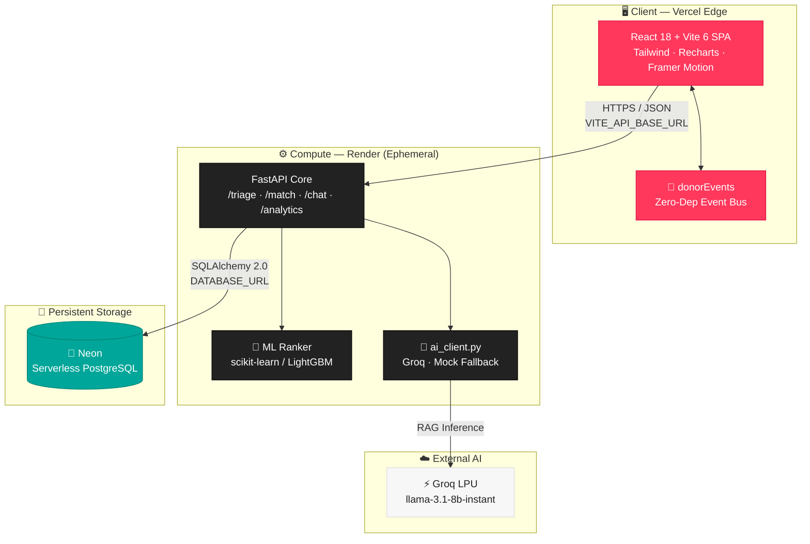
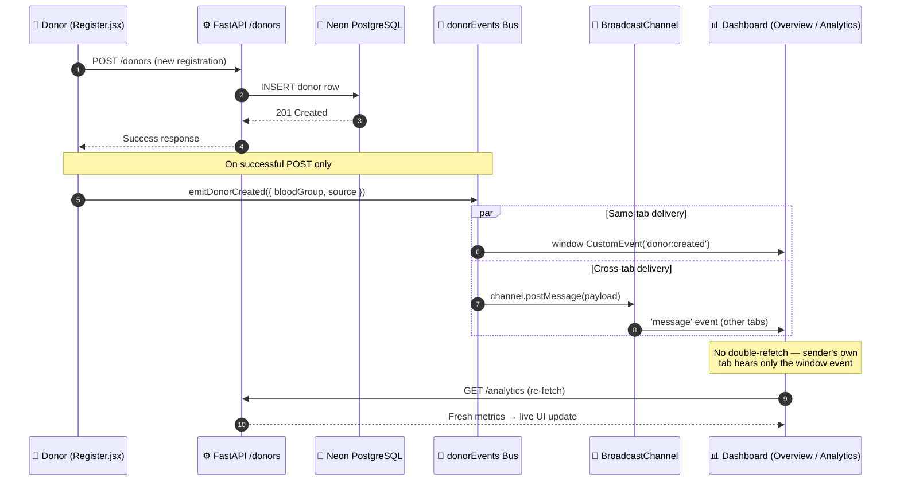

<div align="center">

# 🩸 RaktaSetu

### _The Bridge Between a Request and a Rescue_

**An AI-powered, zero-budget blood donation matching platform** — intelligent triage, hybrid-ranked donor matching with consent enforcement, RAG-powered chat, and a real-time NGO command center.

<br/>

[](https://raktasetu-frontend.vercel.app/)
[](https://github.com/)
[](LICENSE)
[](CONTRIBUTING.md)
[](#-the-engineering-journey)

<br/>

### 🔗 Live Deployment

| 🌐 Frontend (Vercel) | ⚙️ API Base (Render) |
| :---: | :---: |
| **[raktasetu-frontend.vercel.app](https://raktasetu-frontend.vercel.app/)** | **[raktasetu-backend.onrender.com](https://raktasetu-backend.onrender.com)** |

</div>

> [!NOTE]
> RaktaSetu runs **entirely on free-tier infrastructure** — Vercel (frontend), Render (compute), Neon (serverless PostgreSQL), and Groq (LLM inference). Production-grade durability at **$0/month**.

---

## 📖 Table of Contents

- [✨ Overview](#-overview)
- [🏗️ System Architecture](#️-system-architecture)
- [🔄 Real-Time Analytics Sync](#-real-time-analytics-sync)
- [🧭 The Engineering Journey](#-the-engineering-journey)
- [🛠️ Tech Stack](#️-tech-stack)
- [🚀 Core Features](#-core-features)
- [⚡ Local Setup Guide](#-local-setup-guide)
- [🔐 Environment Templates](#-environment-templates)
- [🔮 Future Scaling & Roadmap](#-future-scaling--roadmap)
- [📄 License](#-license)

---

## ✨ Overview

RaktaSetu ("Blood Bridge") connects **blood requests** to **eligible donors** through a pipeline of ML ranking, consent enforcement, and conversational AI — wrapped in a high-trust, Airbnb-inspired consumer interface.

> **The problem:** Blood banks and NGOs coordinate over fragmented spreadsheets and phone chains. Matching a rare blood type to a nearby, eligible, consenting donor in an emergency is slow and manual.
>
> **The RaktaSetu answer:** An AI triage layer scores urgency, a hybrid ML ranker surfaces the best donors, and a RAG chatbot answers donor and NGO questions in natural language — all served from a live dashboard that updates the instant a new donor registers.

```
📁 RaktaSetu_final
├── 🎨 bloodwarriors-frontend/   → Vite + React NGO Command Center & Donor Portal
│   └── src/
│       ├── components/          → ParticleGraph, Toast, ProtectedRoute
│       ├── lib/                 → donorEvents (event bus), api, AuthContext
│       └── pages/               → Landing, Overview, donor/*, ngo/*
├── ⚙️ bloodwarriors-backend/    → FastAPI core (triage, match, chat, analytics)
│   ├── app/
│   │   ├── main.py              → All API routes
│   │   ├── ai_client.py         → Groq engine + mock fallback
│   │   └── database.py          → SQLAlchemy engine binding
│   └── ml/                      → Donor ranking model artifacts
└── 🚢 render.yaml               → Infrastructure-as-code for Render
```

---

## 🏗️ System Architecture

> High-level view: a **React/Vite SPA** talks to a **FastAPI** core, which fans out to **Neon PostgreSQL** for persistent state and **Groq** for LLM inference.



---

## 🔄 Real-Time Analytics Sync

> **The challenge:** The app carries **no global store** (no Redux, no React Query). NGO dashboards fetch once on mount — so a donor registered in another tab never appears without a manual refresh.
>
> **The solution:** A **zero-dependency pub/sub event bus** (`donorEvents.js`) bridges same-tab (`CustomEvent`) and cross-tab (`BroadcastChannel`) delivery. A successful `POST /donors` emits an event; every mounted dashboard re-fetches instantly.



---

## 🧭 The Engineering Journey

> _Every trade-off below is real. This section documents what broke, why, and how we shipped anyway._

### 🌱 Phase 1 — Local Prototyping & The Graph DB Dream

The original vision leaned hard into **graph-native modeling**. Donor↔request matches, NGO↔hospital links, and referral chains are fundamentally *relationships*, so an embedded graph database (**KùzuDB**) was chosen to store edges natively and traverse them at query time. Locally, it was elegant: relational entities in SQLAlchemy, relationship entities in the graph layer, zero join-table bloat.

> ✅ **Win:** Clean domain separation and fast local relationship traversal.
> ⚠️ **Latent risk:** The graph lived as **files on local disk** — an assumption that would not survive the cloud.

### 🚀 Phase 2 — The Deployment Reality & Database Pivot

Deployment exposed the flaw. **KùzuDB required C++ build tools** to compile its native extensions, and the build **broke on Render's Free Tier Linux environment**. Worse, Render's containers are **ephemeral** — the local filesystem is wiped on every deploy, restart, and idle spin-down. Any graph state on disk was doomed regardless.

> 🔴 **Failure:** Native C++ compilation failed on Render's free tier; embedded graph files couldn't persist on ephemeral containers.
>
> 🟢 **Solution — Pivot to pure PostgreSQL via Neon.** We migrated all persistence onto **Neon serverless PostgreSQL** through the existing **SQLAlchemy** layer. The graph — including conversational memory — was **flattened into relational tables** (`chat_sessions`, `chat_messages`). The app switches on `DATABASE_URL`: a `postgresql://` string uses Neon; unset, it falls back to local SQLite. **No model or query rewrites — only the engine binding changed.**
>
> ⚖️ **Trade-off:** We traded native graph-traversal speed for **rock-solid cloud deployment stability** and true cross-restart persistence — at **$0 of managed infrastructure**.

### 🔥 Phase 3 — Production Hurdles

Two subtle production-only bugs surfaced after launch.

**Failure 1 — The Environment Variable Trap (AI stuck in MOCK mode).**
A dependency pin (`groq>=0.11` — the `0.9.0` line breaks on `httpx>=0.28`) combined with a `USE_MOCK_AI=True` default meant production could **silently fall back to deterministic mock responses** even with a real key present.

> 🟢 **Solution — Auto-detect override.** `ai_client.py` now validates the key (non-empty, not the placeholder) and **automatically forces LIVE mode when a usable `GROQ_API_KEY` is detected — overriding `USE_MOCK_AI` entirely.** Mock mode only survives when there is genuinely nothing to call. The override logs itself: `[AI] USE_MOCK_AI=True was overridden -> LIVE mode`.

**Failure 2 — Stale Dashboards After Donor Registration.**
With no global store, dashboards fetched once on mount. A newly registered donor never appeared without a manual refresh — unacceptable for a live command center.

> 🟢 **Solution — Zero-dependency cross-tab event bus.** Rather than bolt on Redux and bloat the bundle, we built `donorEvents.js`: a tiny pub/sub combining `window.CustomEvent` (same-tab) and `BroadcastChannel` (cross-tab). A successful registration emits one event; every mounted dashboard re-fetches instantly. **Real-time UX, zero new dependencies, zero bundle bloat.**

---

## 🛠️ Tech Stack

### 🎨 Frontend

| Technology | Role |
| :--- | :--- |
| **React 18** | Component UI runtime |
| **Vite 6** | Lightning-fast dev server & build |
| **Tailwind CSS 3.4** | Airbnb-inspired design system (token-driven) |
| **Recharts 3** | Interactive analytics charts |
| **Framer Motion** | Fluid page & element animations |
| **Lucide React** | Icon system |
| **React Router 6** | Client-side routing |
| **Axios** | Typed API client |

### ⚙️ Backend & Data

| Technology | Role |
| :--- | :--- |
| **FastAPI** | High-performance async API core |
| **SQLAlchemy 2.0** | ORM & engine binding (Neon ↔ SQLite) |
| **Neon PostgreSQL** | Serverless persistent storage |
| **scikit-learn / LightGBM** | Donor-ranking ML models |
| **Groq (`llama-3.1-8b-instant`)** | RAG chat & triage inference |
| **Pydantic 2** | Request/response validation |
| **Uvicorn** | ASGI server |

### 🚢 Infrastructure

| Platform | Purpose |
| :--- | :--- |
| **Vercel** | Frontend hosting (edge CDN) |
| **Render** | Backend compute (free web-service tier) |
| **Neon** | Serverless PostgreSQL |
| **Groq** | Free-tier LLM inference (30 req/min) |

---

## 🚀 Core Features

> [!TIP]
> Every feature below is designed to run on free-tier limits without degrading the user experience.

- 🧠 **ML-Driven Donor Matching** — A hybrid ranker (scikit-learn / LightGBM) scores donors on eligibility, proximity, and history, with **consent enforcement** baked into the pipeline.
- 💬 **RAG-Powered Chatbot** — Groq-backed conversational assistant for donors and NGOs, with conversation memory persisted in relational `chat_sessions` / `chat_messages`.
- 📊 **Real-Time Interactive UI** — Recharts dashboards that re-fetch the instant a donor registers, powered by the cross-tab `donorEvents` bus — **no manual refresh, no Redux**.
- 🎇 **Dynamic Canvas Particle Engine** — A hand-built `<canvas>` particle graph (`ParticleGraph.jsx`) renders the living donor network as an ambient, high-trust visual centerpiece.
- 🩺 **AI Triage Layer** — `POST /triage` scores urgency and routes requests straight into the matching matrix via URL params — zero extra clicks.
- 🔐 **Consent-First Design** — Matching respects donor consent state at every ranking step.

---

## ⚡ Local Setup Guide

> **Prerequisites:** Python **3.11+**, Node.js **18+**, and `git`. A Groq API key and Neon database are **optional** — the app runs fully offline with mock AI and local SQLite.

### 1️⃣ Clone the Repository

```bash
git clone https://github.com/<your-org>/RaktaSetu.git
cd RaktaSetu
```

### 2️⃣ Backend — FastAPI

```bash
cd bloodwarriors-backend

# Create & activate a virtual environment
python -m venv .venv

# Windows (PowerShell)
.venv\Scripts\Activate.ps1
# macOS / Linux
source .venv/bin/activate

# Install dependencies
pip install -r requirements.txt

# Configure environment (see template below)
cp .env.example .env      # then edit .env

# (Optional) seed the local database
python seed_db.py --force

# Run the dev server → http://localhost:8000
uvicorn app.main:app --reload
```

> 📚 Interactive API docs are auto-generated at **`http://localhost:8000/docs`**.

### 3️⃣ Frontend — Vite + React

```bash
cd bloodwarriors-frontend

# Install dependencies
npm install

# Configure environment (see template below)
cp .env.example .env      # then edit .env

# Run the dev server → http://localhost:5173
npm run dev
```

> ✅ With both servers running, the frontend proxies to `http://localhost:8000`. Register a donor and watch the dashboard update live.

---

## 🔐 Environment Templates

> [!WARNING]
> **Never commit real secrets.** These `.env.example` files ship *placeholders only*. Copy each to `.env` locally and to your host's secret manager (Render / Vercel) in production. The `.env` files are git-ignored.

### 📄 `bloodwarriors-backend/.env.example`

```dotenv
# ── Database ─────────────────────────────────────────────
# Neon PostgreSQL connection string.
# Leave UNSET to fall back to a local SQLite file for development.
DATABASE_URL=

# ── AI Engine (Groq) ─────────────────────────────────────
# Get a free key at https://console.groq.com
# A valid key AUTOMATICALLY forces LIVE mode (overrides USE_MOCK_AI).
GROQ_API_KEY=your_free_groq_api_key_here

# Deterministic offline responses when no valid key is present.
# Set to "False" only if you intend to always call Groq live.
USE_MOCK_AI=True

# ── CORS ─────────────────────────────────────────────────
# Comma-separated allowed origins. Unset → "*" for local dev.
ALLOWED_ORIGINS=http://localhost:5173
```

### 📄 `bloodwarriors-frontend/.env.example`

```dotenv
# ── API Base URL ─────────────────────────────────────────
# Points the SPA at the backend. Unset → http://localhost:8000
# In production, set to your Render URL:
#   https://raktasetu-backend.onrender.com
VITE_API_BASE_URL=http://localhost:8000
```

---

## 🔮 Future Scaling & Roadmap

> As donor volume grows, these are the architectural moves already on the table.

| Priority | Initiative | Rationale |
| :---: | :--- | :--- |
| 🔴 High | **WebSockets for live chat** | Replace request/response chat polling with a persistent socket for true low-latency conversation and typing indicators. |
| 🔴 High | **Redis caching for dashboard metrics** | Cache `/analytics` aggregates to shave DB load and serve sub-100ms dashboards under concurrent NGO users. |
| 🟠 Medium | **Dedicated vector database (Pinecone / Milvus)** | As donor and knowledge-base data scales, move RAG retrieval off relational tables into a purpose-built ANN vector store. |
| 🟠 Medium | **Horizontal backend scaling** | Move off the single free-tier instance to multiple stateless replicas behind a load balancer; the SQLAlchemy + Neon layer is already stateless-ready. |
| 🟡 Later | **Reintroduce a managed graph layer** | Revisit native graph traversal (e.g. a managed Neo4j) for referral-chain analytics — now that persistence lives in the cloud, not on ephemeral disk. |
| 🟡 Later | **Observability & alerting** | Structured logging, request tracing, and shortage-alert webhooks for NGO operators. |

---

<div align="center">

## 📄 License

Released under the **MIT License** — free to use, fork, and build upon.

<br/>

**Built with 🩸 to make every drop count.**

_RaktaSetu — bridging requests to rescues, one match at a time._

<br/>

[](https://raktasetu-frontend.vercel.app/)
[](https://raktasetu-backend.onrender.com)

</div>
